# Criando um NFT do Pokemon

#### Etapas do desafio:
- Implementar o Token ERC-721
- Publicação na blockchain
- Realizar "batalhas" com os Pokemons
- Transferir NFT entre contas

 
- Começando o desenvolvimento criando uma nova workspace no Ganache 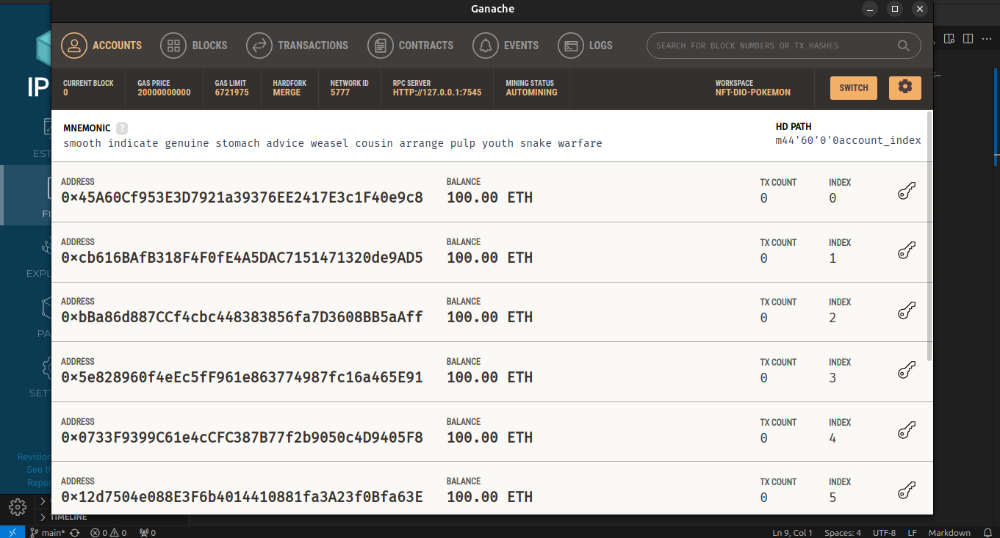
- Conectar o Remix com a blockchain, configurando uma nova conta com o Ganache 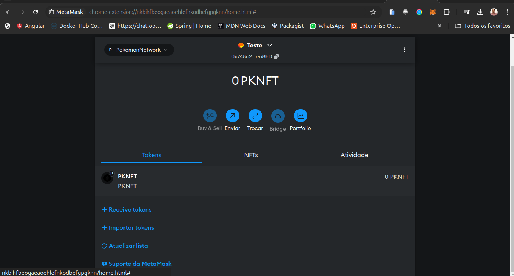 
- Importando uma conta 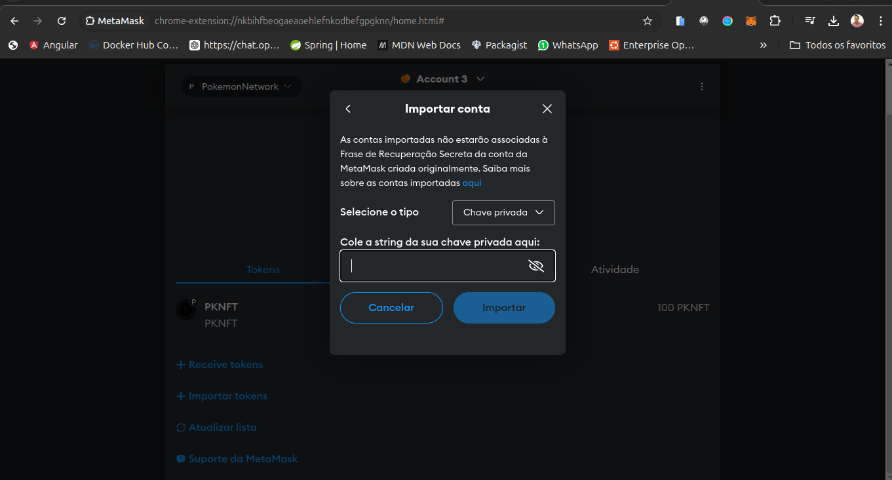 e conta importada 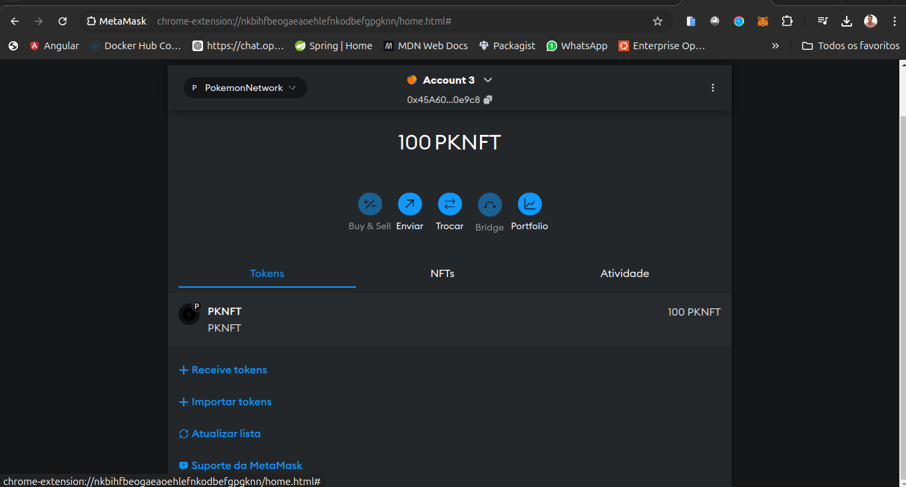 
- Renomeando a conta 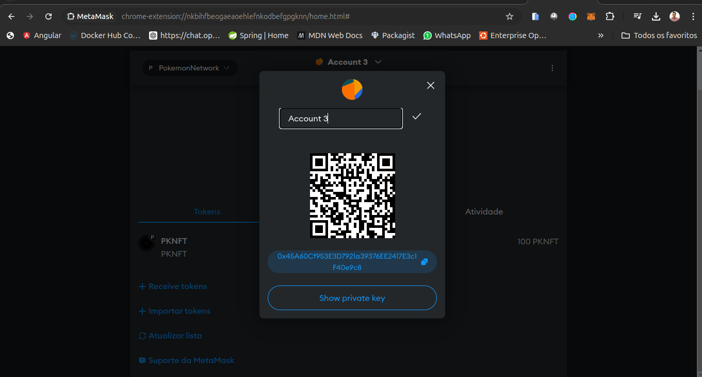 e conta rerenomeada 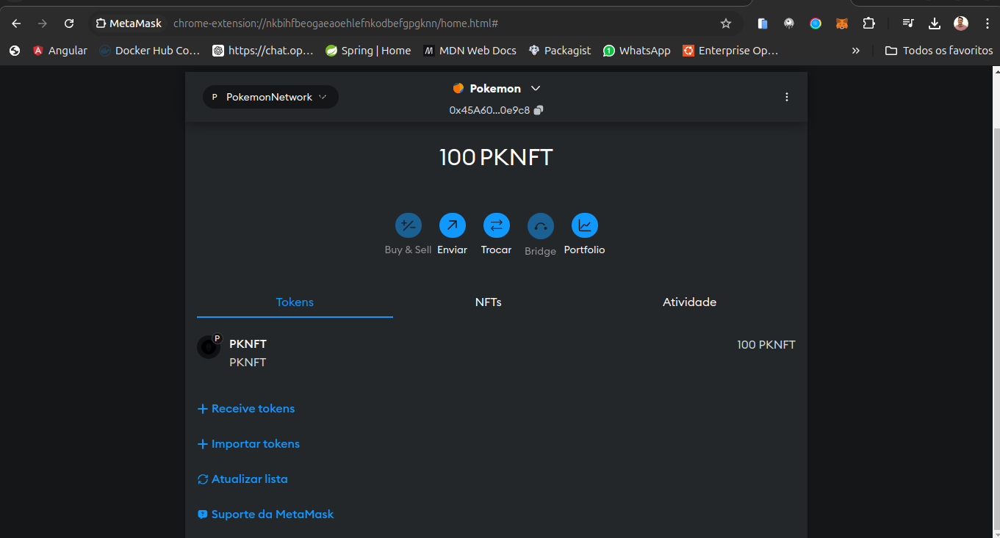 
- Conectar o Remix com o metamask, primeira etada da conexão 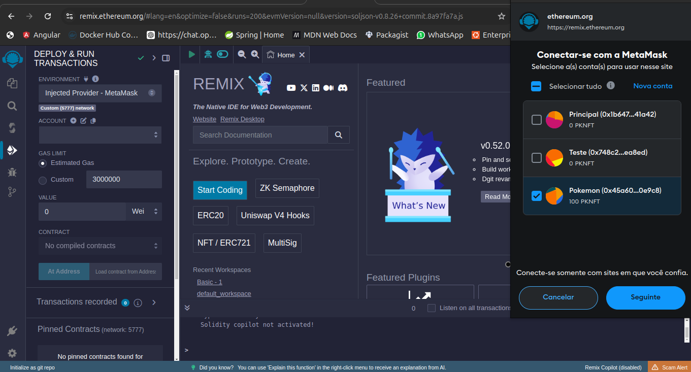, segunda etapada conexão, confirmação 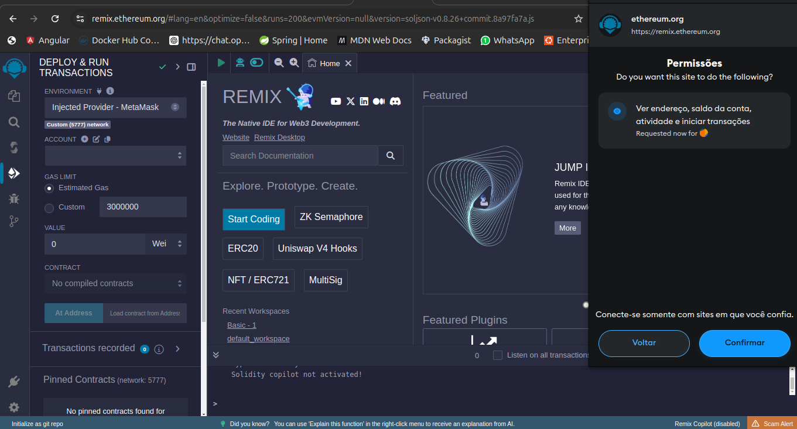 e finalmente conectado 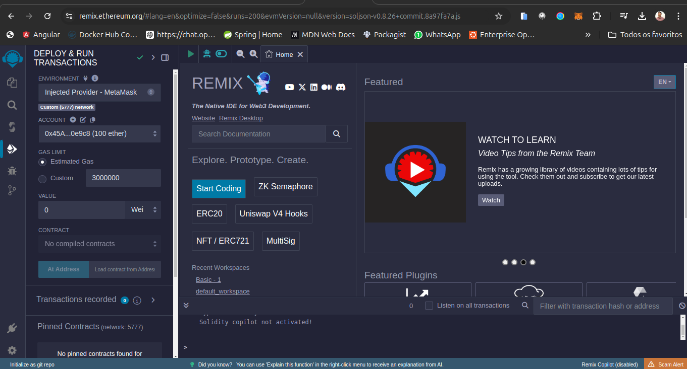 
- Desenvolvimento do código do NFT em solidity, o código foi digita na IDE REMIX 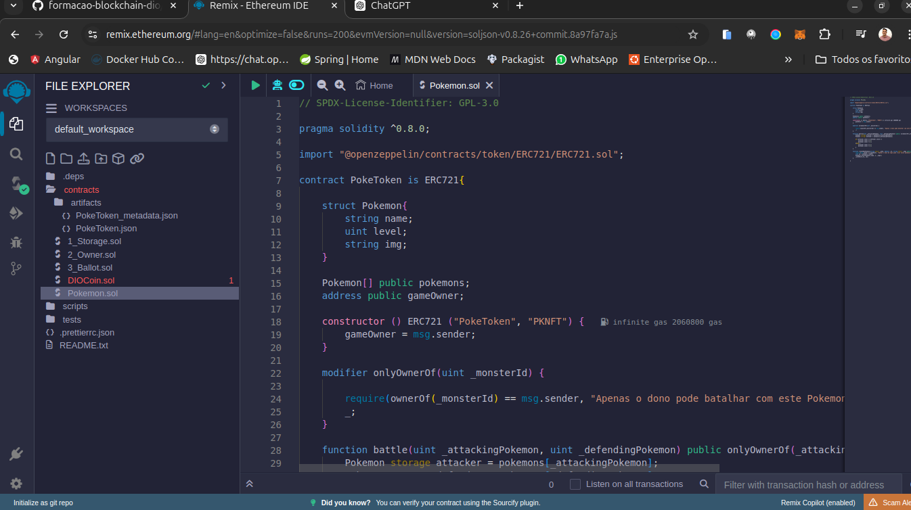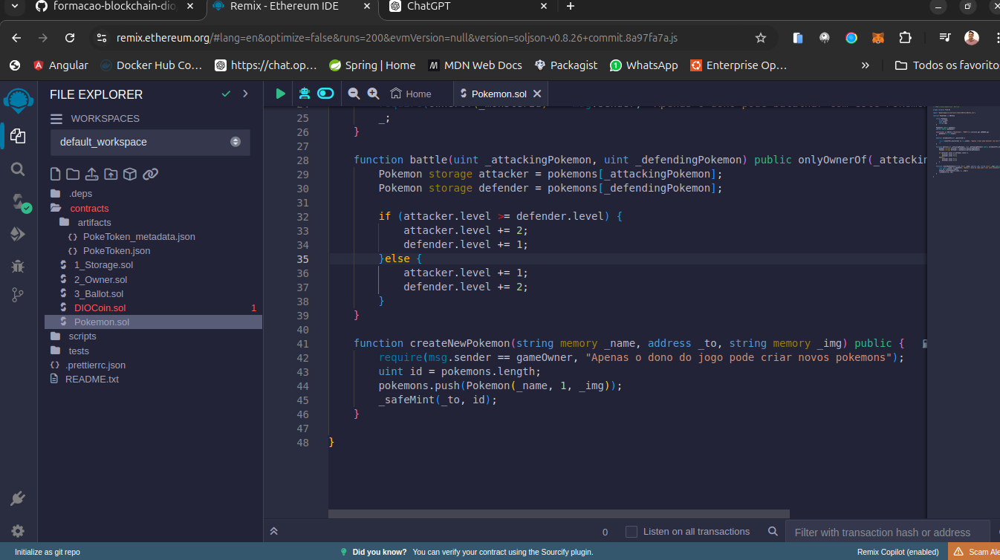 
- Realizando a compilação do contrato 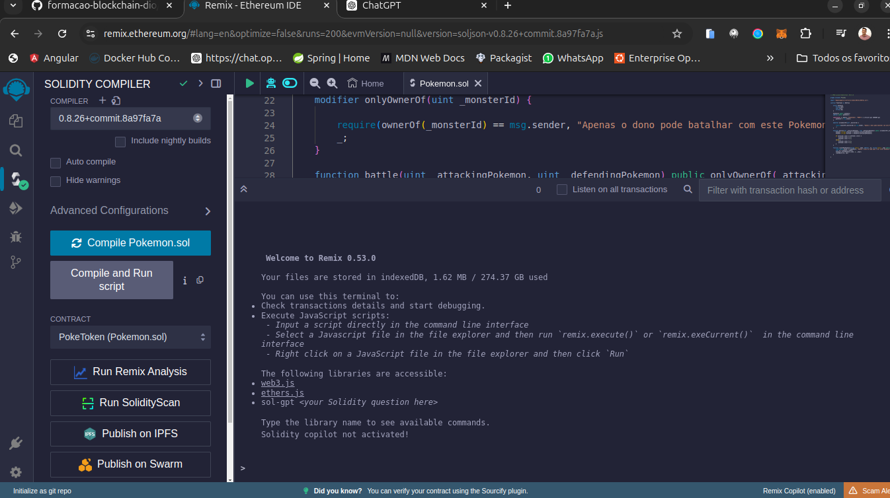 
- Publicar na nossa rede 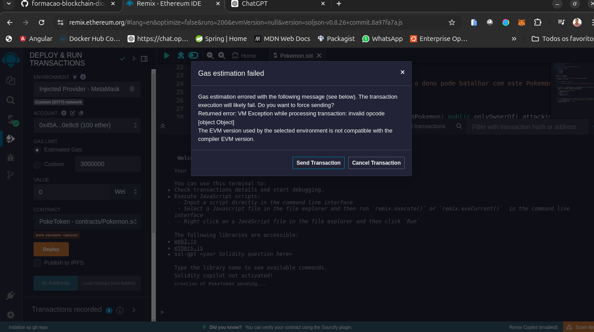 
- Confirmando o pagamento da taxa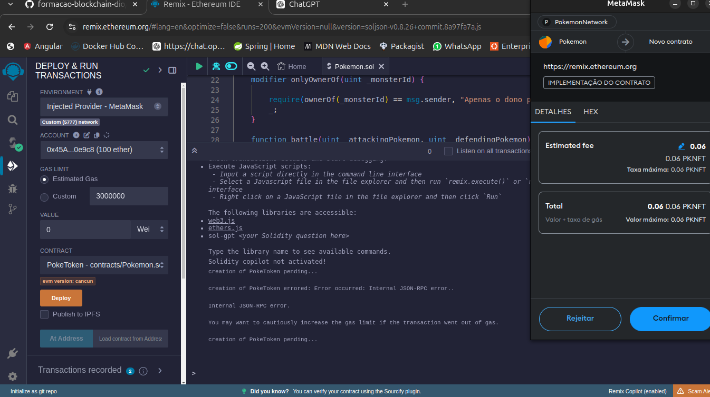 
- Dando erro na publicação 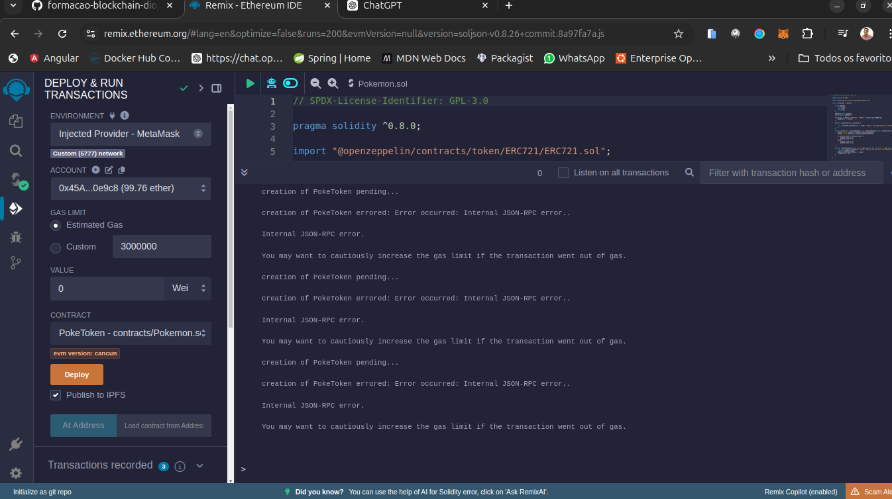 
- Confirmando se no Ganache a transação foi realizada 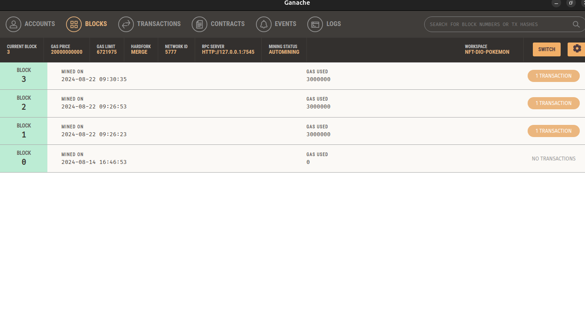 
- Confirmando a transação no bloco 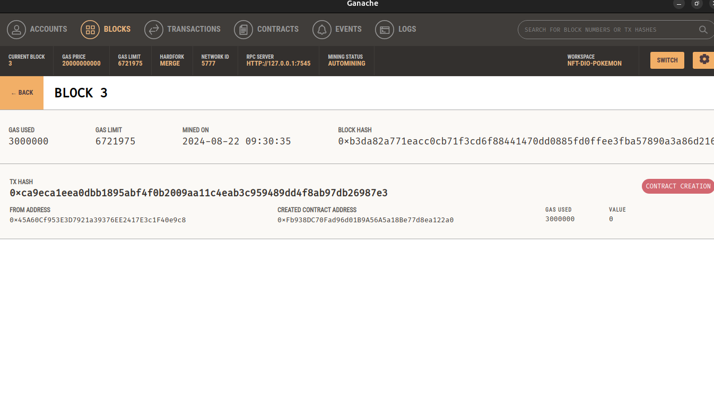 
- Tentei resolver de todos os modos o problema em questão porém não achei solução e já procurei o tutor da aluna na ajudo com outros tópico que não foram respondidas.
